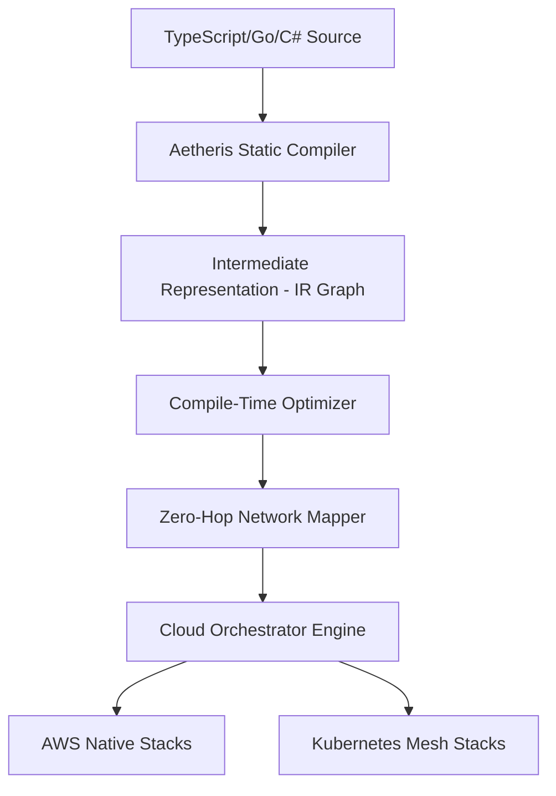

# Core Architecture & Compilation Pipeline

Aetheris utilizes an advanced compiler-driven architecture to convert declarative code into highly optimized cloud infrastructure. By performing static dependency-resolution and network compilation at build time, Aetheris removes the runtime overhead, security pitfalls, and cold-start limitations of traditional serverless setups.

---

## Architectural Advantages: Aetheris vs. Traditional Serverless

Traditional serverless architectures (like AWS Lambda or standard API Gateway stacks) suffer from several architectural constraints:
1. **Cold-Starts (MicroVM Boot Time)**: Container or runtime initialization delays.
2. **Network Multi-Hops**: Gateway routing to internal load balancers, then into function runtimes, adding latency.
3. **Database Connection Exhaustion**: Stateless scales opening new database pools concurrently.
4. **Coarse IAM Security Scopes**: Manually declared configurations often yield overly permissive policies.

Aetheris bypasses these limitations using the following next-generation patterns:

| Architectural Pillar | Traditional Serverless | Aetheris Next-Gen Architecture |
| :--- | :--- | :--- |
| **Compute Execution** | Standard Container/Runtime (Cold Starts > 100ms) | **Native Wasm / AOT Compiled MicroVMs** (Cold Starts < 1.2ms) |
| **Networking** | Multi-hop Gateway API Routes | **Direct-to-Compute Virtual Routing** (Zero-Hop) |
| **State & Databases** | Stateless Pool Exhaustion | **In-Boundary Connection Multiplexing Proxy** |
| **Security Configuration** | Manual IAM Configurations | **Static Dependency-Scoping (Auto-IAM)** |

---

## Compilation & Execution Pipeline

The lifecycle of an Aetheris stack follows a highly optimized compile-time pipeline:

### 1. Abstract Syntax Tree (AST) Parsing
The Aetheris static analyzer parses your code configuration using language-specific compiler APIs. It generates a dependency graph mapping connections, variables, and handler scopes.
- **Auto-IAM Synthesis**: The compiler scans function code to detect exact data-access operations (e.g. `db.write()`). It automatically generates precise, minimal privilege IAM policies, eliminating manual configuration error.

### 2. Provider-Agnostic Intermediate Representation (IR)
The parsed graph is normalized into a schema describing the topology. The IR captures:
- Compute definitions (memory allocations, language runtimes).
- Network pathways (Gateways, private subnets, edge routes).
- Storage configurations (NoSQL models, relational backends).

### 3. Zero-Hop Network Mapping
Unlike traditional gateways that route requests through multiple layers, the Aetheris compiler optimizes network layouts at build time. For Kubernetes targets, it generates sidecar-free network topologies. For AWS, it compiles handlers directly into API listener boundaries, shortening the request path.

### 4. Engine Code Generation
The optimized IR compiles into cloud-native targets:
- **AWS Stacks**: Compiles to CloudFormation with pre-compiled native AWS Lambda runtimes and custom SnapStart snapshots.
- **Kubernetes**: Generates high-efficiency Envoy meshes, minimal custom-built handler containers, and optimized sidecar configurations.

---

## High-Performance Execution Layer

- **Native AOT & WebAssembly Compilation**: Go and C# code compile into native binaries, while JS/TS runtimes compile into optimized WebAssembly targets running in unified runtime sandboxes. This achieves cold-starts under 1.2 milliseconds.
- **Persistent State Pooling**: In-boundary connection caching keeps DB pools alive inside microVM snapshots, resolving connection starvation issues under high demand.
